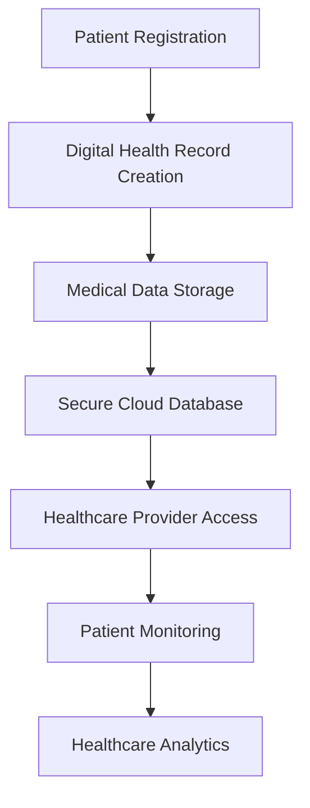

<div align="center">

# 🏥💻 𝘿𝙄𝙂𝙄𝙏𝘼𝙇 𝙃𝙀𝘼𝙇𝙏𝙃 𝙍𝙀𝘾𝙊𝙍𝘿 𝙈𝘼𝙉𝘼𝙂𝙀𝙈𝙀𝙉𝙏 𝙎𝙔𝙎𝙏𝙀𝙈 💻🏥


### 🌍 Smart Healthcare Record Management for Migrant Workers in Kerala

<br>


<br><br>


</div>

---

# 📌 About The Project

> **Digital Health Record Management System** is a modern healthcare platform designed to provide migrant workers in Kerala with secure, portable, and easily accessible digital medical records.

This project aims to improve healthcare accessibility and simplify medical data management through smart digital healthcare infrastructure.

✨ The platform helps with:

- 🏥 Digital patient record management
- 🌍 Healthcare accessibility
- 📱 Portable health information
- 🔐 Secure medical record storage
- 📊 Public health monitoring
- ☁️ Cloud-based healthcare solutions

---

# ✨ Features

<div align="center">

| 🚀 Feature | 💡 Description |
|---|---|
| 🩺 Digital Health Records | Secure patient medical history |
| 🌍 Multi-User Access | Easy access for healthcare providers |
| 📱 Portable Healthcare Data | Access records anywhere |
| 🔐 Secure Authentication | Protected medical information |
| 📊 Health Monitoring | Public health tracking |
| ☁️ Cloud Integration | Real-time data storage |
| 📅 Appointment Management | Patient scheduling support |
| 🧾 Medical Reports | Generate digital reports |

</div>

---

# 🛠️ Tech Stack

<div align="center">

| Technology | Purpose |
|---|---|
| 🐍 Python | Backend Development |
| ⚡ Flask / Django | Web Framework |
| 🗄️ MySQL / MongoDB | Database |
| 🎨 HTML/CSS | Frontend Design |
| 💻 JavaScript | Interactivity |
| ☁️ Cloud Services | Data Storage |
| 🔐 Authentication | Secure Access |

</div>

---

# 📂 Project Structure

```bash
Digital-Health-Record-Management-System/
│
├── static/
│   ├── css/
│   ├── js/
│   └── images/
│
├── templates/
│
├── database/
├── models/
├── routes/
│
├── app.py
├── requirements.txt
└── README.md
```

---

# ⚙️ Installation

## 🔽 Clone Repository

```bash
git clone https://github.com/Abhijit-Bhattacharjee/Digital-Health-Record-Management-System-.git
```

## 📂 Open Project Folder

```bash
cd Digital-Health-Record-Management-System-
```

## 📦 Install Dependencies

```bash
pip install -r requirements.txt
```

## ▶️ Run Application

```bash
python app.py
```

---

# 🌍 Local Preview

```bash
http://localhost:5000
```

---

# 🔄 System Workflow



---

# 🎯 Objectives

- 🏥 Improve healthcare accessibility
- 🌍 Support migrant worker healthcare
- 💻 Digitize medical record systems
- 📊 Improve public health monitoring
- 🔐 Secure healthcare data management
- ☁️ Build scalable healthcare infrastructure

---

# 🌍 SDG Alignment

<div align="center">

| SDG Goal | Contribution |
|---|---|
| 🩺 SDG 3 | Good Health & Well-Being |
| 🌍 SDG 10 | Reduced Inequalities |
| 🏗️ SDG 9 | Innovation & Infrastructure |

</div>

---

# 🔐 Security Features

```diff
+ Secure User Authentication
+ Encrypted Medical Data
+ Cloud Backup Support
+ Privacy Protection
+ Secure Database Access
```

---

# 📸 Preview

<div align="center">


</div>

---

# 🚀 Future Enhancements

- 🤖 AI Health Assistant
- 📱 Mobile Application
- 🌐 Multi-Language Support
- 📊 Advanced Analytics Dashboard
- 🏥 Hospital Integration
- ☁️ Full Cloud Deployment
- 📡 Offline Record Access

---

# 👨‍💻 Developer

<div align="center">

## 🚀 Abhijit Bhattacharjee

### 🌟 Healthcare Technology & AI Enthusiast

GitHub: https://github.com/Abhijit-Bhattacharjee

</div>

---

# 🤝 Contribution

Contributions are always welcome ❤️

```bash
1. Fork Repository
2. Create Feature Branch
3. Commit Changes
4. Push To GitHub
5. Open Pull Request
```

---

# ⭐ Support

If you like this project:

🌟 Star this repository  
🍴 Fork this project  
📢 Share with others  

---

<div align="center">


# 💙 Smart Digital Healthcare For Everyone

### ✨ Building The Future Of Healthcare Through Technology ✨

</div>
